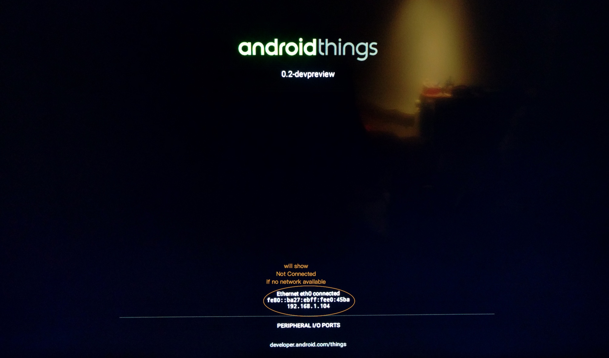

### Hello World Android Things

物联网 IoT(Internet of things) 一个听起来高大上，但是实际上是历史悠久东西，但是随着社会/科技的发展(网络，协议，设备等等共同的发展)，近些年被正式命名了。

以前开发这类的产品都需要复杂的流程，比如厂商基于某款特定的硬件，移植某个嵌入式的操作系统，然后在上面开发定制化的程序，可能需要懂些底层的东西，比如驱动程序等等，而且运行资源都相对来说很有限。

但是 Google 某一天宣布了一个叫做 [Android Things](https://developer.android.com/things/index.html) 的东西，好像很多事情都变的简单些了。

这里就不介绍了，直接入门，记录怎么让第一个程序如何跑起来。

#### 1) 硬件设备 [RASPBERRY PI 3 MODEL B](https://www.raspberrypi.org/products/raspberry-pi-3-model-b/)
我个人比较喜欢这款性价比高的硬件设备，自己买过一些开发板，这个完全不心疼 ^_^

不管是二手的，还是新的，只要型号对的，买个就好了(以前我也很纠结是买原产国还是买国产的，后来就选择买便宜的)

### 2) 操作系统 [Android Things](https://developer.android.com/things/index.html)
https://developer.android.com/things/hardware/raspberrypi.html

下载镜像(https://developer.android.com/things/preview/download.html)，烧录到 Micro SD Card 上，具体办法网上搜索(我这里旧物利用，翻出来原来 Motorola Milestone 上的一张卡)。制作完毕之后就可以插电开机(USB 供电，HDMI 视频输出，HDMI 也可以提供供电)。

开机之后的画面

RASPBERRY PI 3 MODEL B 支持无线网络和有线网络，开发调试 adb 支持无线和有线

我这里使用的是 macOS

查看接入的 SD Card 挂载位置

- `diskutil list`

- `sudo dd bs=1m if=iot_rpi3.img of=/dev/disk3`

具体文件名和挂载位置根据实际情况修改

### 3) 开发程序
https://developer.android.com/things/sdk/samples.html

推出 Android Things 的意图就是物联网会爆发起来(虽然目前还不确切知道什么时候)，所以开发程序必须要简单快速。最简单的看下本 [Sample](https://github.com/guohai/iot/-hello) 就好了。

本程序和普通的 Android 程序配置上差别不大，就是新建一个标准的 Phone/Tablet 项目就好，主要在 app/build.gradle 和 AndroidManifest.xml 当中有点差别

